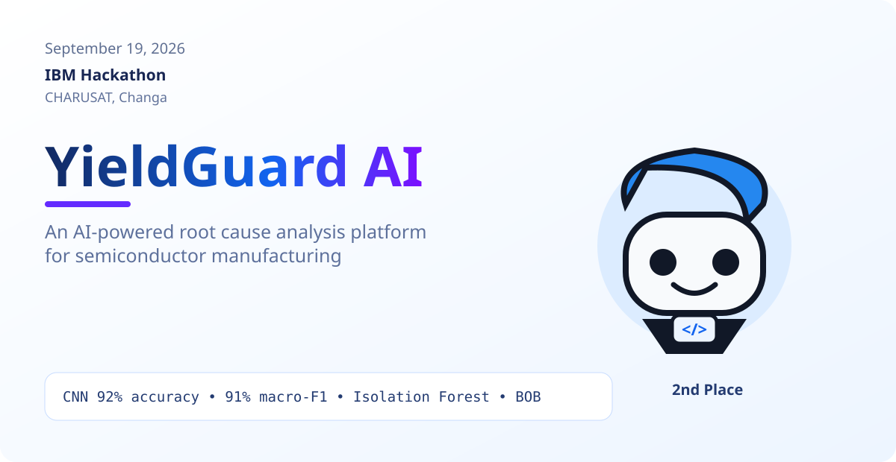
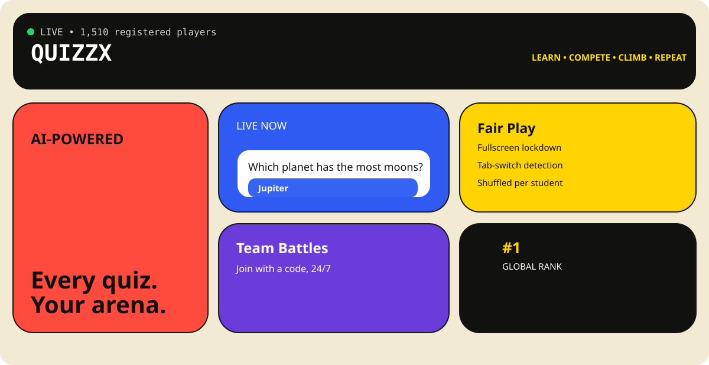

<div align="center">



# HEET PARIKH

### AI • FULL STACK • ROBOTICS • GAME DEV

<a href="https://www.linkedin.com/in/heetparikh/"></a>
<a href="mailto:heet16@gmail.com"></a>
<a href="https://www.instagram.com/heet_1606/"></a>

</div>

---

## 🧱 3D GitHub World

A block-built view of the thing underneath all of this: **my GitHub activity**.

The contribution calendar is rendered as a 3D isometric terrain. The GitHub Action regenerates it automatically.

<div align="center">

<picture>
  <source media="(prefers-color-scheme: dark)" srcset="./profile-3d-contrib/profile-gitblock-dark.svg">
  <source media="(prefers-color-scheme: light)" srcset="./profile-3d-contrib/profile-gitblock.svg">
  
</picture>

</div>

> The first render is a fallback. The scheduled workflow replaces it with the live `git-terrain` contribution world.

---

## 🏆 Achievements Unlocked

```text
2026   🥈 IBM Hackathon       → 2nd Place          → YieldGuard AI
2026   🥈 Techathon 2026      → 1st Runner-Up      → FormAI
2025   🏅 Odoo 2025           → National Finalist   → Traveloop
```

---

## 🚀 The 3 Builds I Want You To Actually See

### 01 / YieldGuard AI



**AI-powered root-cause analysis for semiconductor manufacturing.**

Built for the **IBM Hackathon** with an AI orchestrator named **BOB**.

- CNN-based yield / defect analysis
- **92% accuracy** in one recorded result
- **91% macro-F1** in one recorded result
- Isolation Forest for anomaly detection
- Team: **Dhrumil Amin · Akshat Patel · Heet Parikh · Parva Chhatrola**
- Result: **2nd Place**

---

### 02 / QuizzX / Blueverse



**A competitive quiz platform that grew from a Vite prototype into a full product.**

**V1:** React + Vite  
**V2:** Next.js 16

Current product direction includes:

- Anti-cheat / fair-play controls
- Leaderboards
- Admin panel
- Live rooms
- Ranked mode
- AI-assisted quiz generation
- SRS + product roadmap
- iCreate funding proposal: **₹29,184**

---

### 03 / Vaani AI


**Autonomous AI sales agent for multilingual calling.**

The idea is a pipeline rather than a chatbot:

```text
Lead Discovery
      ↓
Enrichment
      ↓
AI Scoring
      ↓
Campaign
      ↓
Voice Call
      ↓
CRM / Outcome
```

The current build is aimed at the **Futurrizon hackathon**, with multilingual sales calls, autonomous lead discovery and AI-assisted sales workflows.

---

## 🟡 Contribution Arcade

Because a normal contribution graph needed a little more chaos.

<div align="center">

<picture>
  <source media="(prefers-color-scheme: dark)" srcset="./profile-pacman/pacman-contribution-graph-dark.svg">
  <source media="(prefers-color-scheme: light)" srcset="./profile-pacman/pacman-contribution-graph.svg">
  
</picture>

</div>

> The workflow regenerates this from my real GitHub contribution calendar.

---

## 🧪 Other Projects

| Project | What I built |
|---|---|
| **FormAI** | Multilingual OCR government-form assistant using Llama Vision 90B, Gemini Flash, Next.js and FastAPI |
| **RESQ-MESH** | Offline phone-to-phone SOS mesh with a rescue Command Center and autonomous drone component |
| **Traveloop** | AI travel planning app using Next.js 16, MySQL and Clerk |
| **MeetingMonitor** | AI meeting bot with transcription, sentiment analysis and auto-generated MoM |
| **EcoSphere** | Gamification platform with XP, badges, leaderboards and the Sprig mascot |
| **emoDiary** | AI journaling with Hindi, Gujarati and Hinglish support plus a 3D lip-sync avatar |
| **Sign Language Platform** | Two-way text-to-ASL and live sign recognition |
| **Solar Lead Generation** | ML + LLM outreach system using a 15,000-row synthetic dataset for Maharashtra and Gujarat |
| **YUGAS** | Hindu mythology game prototype with Phaser 3 + Three.js, planned around karma and a Dharma Meter |
| **RACE.IO** | Multiplayer racing game with Phaser 3 + Socket.IO |
| **3D CPU Interrupt Factory** | Three.js educational game / simulation |
| **PolyTrack RL Agent** | PPO agent playing through screen capture |
| **Student OS** | AI academic management app concept |
| **Ascend** | Semester tracker |
| **NEXUS Study OS** | Academic workflow / study system |
| **Claude Buddy** | Electron desktop mascot |
| **Gantt Tool** | Roadmap planning tool for QuizzX |
| **Coding Exam Platform** | Custom coding assessment platform design |
| **Arduino / ESP32 / Networking** | Early embedded builds and Cisco Packet Tracer simulations |

---

## 💼 Internship

### MCT IT Solutions · May 2026 → June 2026

Built a **full end-to-end ecommerce platform for a client** with:

`Next.js / TypeScript` • `Razorpay` • `Automated Mailing`

---

## 🎮 Game Lab

```text
YUGAS
 ├─ Phaser 3
 ├─ Three.js
 ├─ Karma System
 └─ Dharma Meter

RACE.IO
 ├─ Phaser 3
 ├─ Socket.IO
 └─ Multiplayer Racing

3D CPU INTERRUPT FACTORY
 ├─ Three.js
 └─ Educational Simulation

POLYTRACK RL
 ├─ PPO
 └─ Screen Capture
```

---

## 🤖 What I Like Building

```text
AI
 ├─ Computer Vision
 ├─ LLM Orchestration
 ├─ OCR
 ├─ AI Agents
 ├─ Voice AI
 └─ Anomaly Detection

FULL STACK
 ├─ Next.js
 ├─ React
 ├─ Node.js
 ├─ FastAPI
 ├─ MySQL
 └─ Supabase

SYSTEMS
 ├─ ROS2
 ├─ Arduino
 ├─ ESP32
 ├─ Drones
 ├─ Offline Mesh
 └─ Networking

GAME DEV
 ├─ Three.js
 ├─ Phaser 3
 ├─ Socket.IO
 └─ Reinforcement Learning
```

---

## ⚙️ Core Stack

<div align="center">


</div>

---

## 📊 GitHub Stats

<div align="center">


<br/>


</div>

---

## 🛰️ Current Build Queue

```text
[██████████████████████░░] Vaani AI
[██████████████████░░░░░░] RESQ-MESH drone
[███████████████░░░░░░░░] Solar lead generation
[████████████░░░░░░░░░░░] YUGAS
```

---

<div align="center">

### `heet@github:~$ echo "build something."`

**Thanks for stopping by.**

</div>
